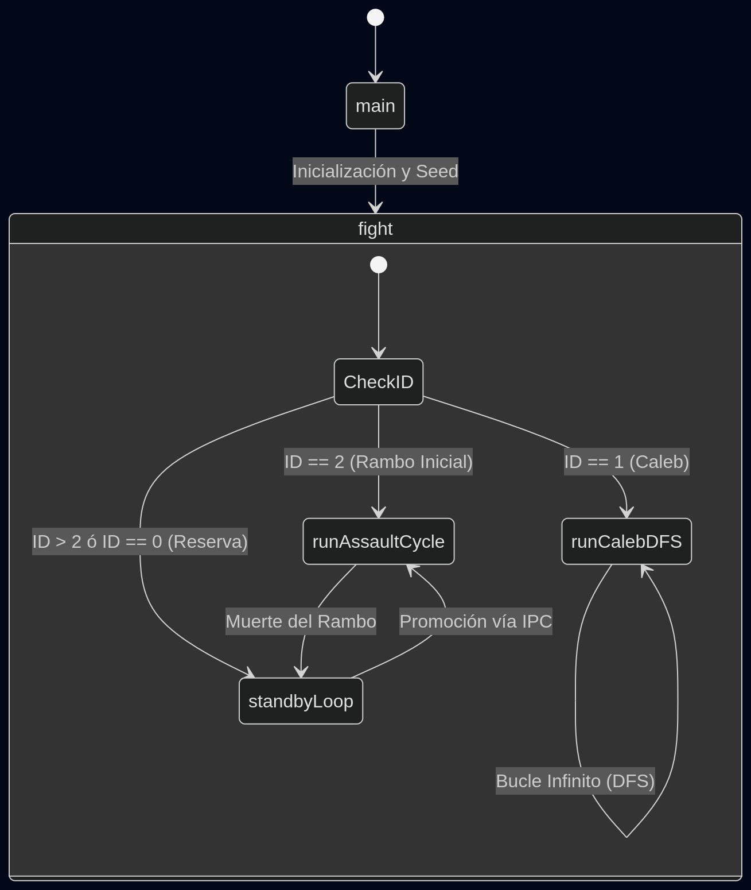

# Manual Técnico de Arquitectura y Workflow: "Platoon Chunk"

## 1. Arquitectura del Sistema y Workflow

### Visión General
El modelo **"Platoon Chunk"** es una arquitectura distribuida de IA tipo enjambre diseñada para el motor GunTactyx (Small 1.8). El sistema divide a un equipo de bots en roles altamente especializados para maximizar la exploración territorial y la letalidad táctica, minimizando el consumo de CPU virtual. 

El pelotón se compone de cuatro entidades lógicas:
1. **Caleb (ID 1 - Explorador Autónomo):** Un único bot dedicado a trazar el mapa mediante un algoritmo de Búsqueda en Profundidad (DFS). Evita el combate y actúa como un radar móvil.
2. **Rambo Activo (ID Dinámico - Asalto Táctico):** Un único bot encargado de interceptar y eliminar las amenazas descubiertas por Caleb.
3. **Rambo Suplentes (Standby):** El resto del pelotón que patrulla en estado pasivo, consumiendo recursos mínimos, a la espera de heredar el rol de "Rambo Activo".
4. **Jefe de Escuadrón (ID 0 - Chief):** Entidad reservada por el motor, mantenida deliberadamente en la retaguardia mediante la lógica de exclusión.

### Ciclo de Vida del Sistema
La ejecución parte de la rutina nativa `main()`, que inyecta semillas estocásticas y redirige al orquestador `fight()`.

### Protocolo de Comunicación (IPC)
El motor limita las comunicaciones a un solo entero (`word`) por canal. Para transmitir inteligencia compleja (vectores espaciales), se implementó un contrato asíncrono estructurado en tres canales:
- **`CH_ENEMY_SPOTTED` (0):** Transmisión de telemetría de objetivos.
- **`CH_CALEB_DOWN` (1):** Alerta de estado vital crítico del explorador.
- **`CH_RAMBO_ACTIVE` (2):** Señal de vida (ACK), reporte de atascos (`MSG_STUCK`) y nombramiento del sucesor en la cadena de mando.

**Secuencia de Interrupción de Combate:**
Cuando Caleb detecta un enemigo, divide la telemetría enviando un tren de pulsos:
1. `MSG_ENEMY_CONTACT` (Apertura de Handshake).
2. `Yaw Encoded` (Miliradianes escalados vía `YAW_SCALE_F`).
3. `Distance` (Metros truncados).
El Rambo Activo lee y reconstruye (`ipc_pollIncoming()`) estos valores, desencadenando la interrupción que transiciona su estado de patrulla hacia la persecución activa (`g_enemyContactActive = true`).

---

## 2. Análisis de Casos y Trazabilidad Funcional

| Evento | Módulo | Función Involucrada | Acción Principal |
| :--- | :---: | :--- | :--- |
| **Colisión Inminente** | Caleb | `aim()` / `doDFSExplore()` | Backtracking y omisión de nodo DFS. |
| **Atasco Físico (Stuck)** | Caleb | `checkAntiStuck()` | Evasión mecánica y reporte `MSG_STUCK`. |
| **Muerte de Rambo** | Rambo | `selectNextRamboID()` | Pase de testigo al siguiente ID de reserva. |
| **Muerte de Caleb** | Caleb | `ipcReportKIA()` | Alerta global de cese de inteligencia. |
| **Combate** | Rambo | `chooseWeapon()` | Prevención de fuego amigo y selección balística. |
| **Vigilia** | Reserva | `doPatrolMovement()` | Evasión caótica local para evitar aglomeraciones. |

### 2.1. Detección de Obstáculos (Colisión con Pared)
Caleb utiliza el trazado de rayos del arma en lugar de los sensores de la cabeza para garantizar que la trayectoria real de avance esté libre. 
En `doDFSExplore()`, si el bot está alineado con su objetivo (`abs(turn) < FRONT_TOLERANCE_F`), ejecuta `aim(item)`. Si el retorno es menor a `WALL_DIST_F` y es una pared (`ITEM_NONE`), Caleb ejecuta un `walkbk()` (paso atrás) e invoca `dfsAdvance()` para descartar esa rama del DFS y saltar al siguiente nodo de la pila (Backtracking forzado).

### 2.2. Baja de Combate (Muerte del Rambo)
El simulador no notifica muertes mediante eventos. El script soluciona esto con *Polling* de salud dentro de `runAssaultCycle()`. Si `getHealth() <= 0.0`:
1. El Rambo moribundo llama a `selectNextRamboID()`. Esta función itera los IDs disponibles saltándose al ID 0 (Chief) y al ID 1 (Caleb).
2. El bot difunde su testamento: `speak(CH_RAMBO_ACTIVE, g_ramboID)`.
3. Todos los bots en `standbyLoop()` están escuchando. El bot cuyo ID coincida con el nuevo `g_ramboID` rompe el ciclo pasivo (`return`) y el despachador en `fight()` lo transiciona inmediatamente a `runAssaultCycle()`.

### 2.3. Punto Crítico de Fallo (Muerte del Caleb)
Si la salud de Caleb desciende de `HEALTH_LOW_F` (25.0 HP), asume que será destruido.
Invoca `ipcReportKIA()`, emitiendo `MSG_CALEB_KIA` en `CH_CALEB_DOWN`. Los Rambos procesan este flag (`g_calebKIA = true`). 
*Nota de Arquitectura:* Caleb es un nodo lógico único. Su caída significa la pérdida del "radar". Tras su muerte, la exploración activa DFS se detiene. El pelotón (Rambos) entra en modo defensivo perpetuo, reaccionando únicamente a los estímulos sensoriales directos que reciban (`hear` y `watch`).

### 2.4. Mecánica de Enfrentamiento (Ataque Rambo)
Cuando el Rambo recibe el tren IPC, orienta su vector (`rotate(getDirection() + g_lastEnemyYaw)`).
Durante el `runAssaultCycle()`, usa `watch()` para confirmar visualmente al enemigo. 
Al avistarlo, la función `chooseWeapon(dist)` orquesta el ataque:
1. Valida el uso de explosivos analizando la distancia y el inventario.
2. Invoca un raycast preventivo con `aim(aimTarget)`. Si un aliado (`ITEM_FRIEND`) se cruza en la línea de fuego, suspende el disparo, evadiendo el *Fuego Amigo*.
3. De tener campo abierto, gatilla el armamento y fuerza el avance (`run()`).

### 2.5. Estado de Reserva (Bots sin rol activo)
Controlados por `standbyLoop()`, los bots con IDs > 2 se dispersan para no entorpecer a Caleb ni al Rambo activo.
Se mantienen caminando lentamente, alternando su dirección con `doPatrolMovement()` que inyecta rotaciones pseudo-aleatorias y reacciona a las paredes (`sight() < WALL_AVOID_DIST_F`). Su principal tarea biológica es invocar `wait()` e `ipc_pollIncoming()` para alivianar el coste del procesador y monitorear la cadena de mando.

### 2.6. Lógica de Mando (El Jefe / ID 0)
El Jefe de Equipo (Chief) tiene condiciones especiales en GunTactyx (ej. soltar la bandera). La función `selectNextRamboID()` lo ignora deliberadamente a menos que sea el único bot vivo remanente. Esto garantiza que el "Rey" del pelotón permanezca protegido en la zona de reserva (`standbyLoop()`), actuando estrictamente como póliza de seguro final.

---

## 3. Especificaciones Técnicas

### Gestión de Memoria y Schedulling (El uso de `wait`)
El motor de GunTactyx carece de subprocesos *preemptivos*; una iteración infinita sin retornos asfixiaría el hilo principal de la máquina virtual (Pawn), frisando al bot.
La arquitectura impone el uso sistemático de **Rendición de CPU (Yielding)**:
- `wait(ASSAULT_LOOP_WAIT_F)` (0.05s) en bucles críticos de combate para hiper-reactividad.
- `wait(STANDBY_LOOP_WAIT_F)` (0.1s) en bucles de reserva para reducir el consumo de CPU de la IA pasiva.
- `wait(IPC_POLL_WAIT_F)` (0.1s) dentro del handshake asíncrono para dar tiempo a que el buffer local reciba las palabras transmitidas remotamente sin congelar el juego.

### Protección de Tipos (Tag Mismatch)
Small 1.8 falla al analizar macros condicionales con números de punto flotante en tiempo de preprocesamiento, originando los errores [213] Tag Mismatch. Esto se erradicó estableciendo un bloque de `CONSTANTES FLOTANTES GLOBALES` estáticamente tipadas (ej. `new float:CELL_SIZE_F = 10.0`), asegurando integridad de memoria y fiabilidad en todas las comparaciones espaciales.

### Estructura de Datos (Grilla y DFS)
- **DFS Iterativo:** En lugar de saturar el Heap con recursión, Caleb utiliza una pila LIFO pre-asignada `g_dfsStack[64]`. Esto garantiza un consumo de memoria plano O(1).
- **Bitfield de Celdas Visitadas:** Para mapear 196 cuadrantes (14x14), un arreglo booleano tradicional ocuparía 196 celdas (784 bytes). Se implementó un algoritmo de compresión a nivel de bits: `g_visited[7]`. Siete enteros de 32 bits equivalen a 224 flags (7 * 32), permitiendo operaciones súper eficientes mediante shifteos a nivel máquina (`idx / 32` y `idx % 32`).
